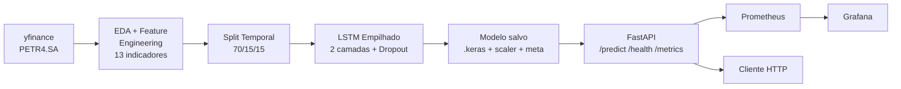

# Tech Challenge - Fase 4: Deep Learning e IA (LSTM Stock Predictor)

## FIAP PosTech - Machine Learning Engineering


Pipeline completo de Deep Learning (LSTM) para previsão do preço de fechamento da ação **PETR4.SA** (Petrobras), com API REST em FastAPI, monitoramento via Prometheus + Grafana, e deploy em container Docker.

## Links Importantes

- **Vídeo de Apresentação:** https://drive.google.com/file/d/1BQs6EAF0h_npc9E7QoYEfdPbL411BxaB/view?usp=sharing
- **Repositório GitHub:** https://github.com/SheylaSilvana/tech-challenge-petr4-lstm
- **API em Produção:** https://tech-challenge-petr4-lstm.onrender.com (Swagger: `/docs`)

---

## Sumário

- [Arquitetura](#arquitetura)
- [Requisitos Atendidos](#requisitos-atendidos)
- [Estrutura do Projeto](#estrutura-do-projeto)
- [Quick Start](#quick-start)
- [Pipeline de Dados e Modelo](#pipeline-de-dados-e-modelo)
- [API](#api)
- [Monitoramento](#monitoramento)
- [Deploy](#deploy)

---

## Arquitetura



### Pipeline ML

```
┌─────────────┐    ┌─────────────────┐    ┌──────────────┐    ┌──────────────┐
│  yfinance   │───▶│ Feature Eng.    │───▶│ Split        │───▶│ LSTM         │
│  OHLCV      │    │ SMA/EMA/RSI/    │    │ Temporal     │    │ Keras/TF     │
│  desde 2015 │    │ MACD/Bollinger  │    │ 70/15/15     │    │ 2 camadas    │
└─────────────┘    └─────────────────┘    └──────────────┘    └──────┬───────┘
                                                                     │
                                                                     ▼
┌─────────────┐    ┌─────────────────┐    ┌──────────────┐    ┌──────────────┐
│   Cliente   │◀──▶│  FastAPI        │◀──▶│ StockPred.   │◀───│  Modelo +    │
│  HTTP/JSON  │    │  /api/v1/...    │    │  (inferência) │    │  Scaler +    │
│             │    │  Swagger /docs  │    │              │    │  Meta JSON   │
└─────────────┘    └────────┬────────┘    └──────────────┘    └──────────────┘
                            │
                            ▼ /metrics
                   ┌─────────────────┐    ┌──────────────┐
                   │   Prometheus    │───▶│   Grafana    │
                   └─────────────────┘    └──────────────┘
```

---

## Requisitos Atendidos

| # | Requisito | Implementação | Status |
|---|-----------|---------------|--------|
| 1 | Coleta de dados (yfinance) | `app/ml/data.py:download_history` | ✅ |
| 1 | Pré-processamento | `app/ml/features.py` (13 indicadores) | ✅ |
| 2 | Modelo LSTM | `app/ml/model.py:build_lstm` (2 LSTM + Dropout + Dense) | ✅ |
| 2 | Treinamento + hiperparâmetros | `ml_training/train.py` (EarlyStopping, ReduceLROnPlateau) | ✅ |
| 2 | Avaliação (MAE/RMSE/MAPE) | `app/ml/model.py:regression_metrics` | ✅ |
| 3 | Salvamento do modelo | `.keras` + `.joblib` + `.json` em `models/` | ✅ |
| 4 | API RESTful (FastAPI) | `app/main.py` + `app/api/routes.py` | ✅ |
| 5 | Monitoramento | Prometheus + Grafana + métricas custom | ✅ |
| - | Docker | `Dockerfile` + `docker-compose.yml` | ✅ |
| - | Testes | `tests/` (features, métricas, API) | ✅ |
| - | Documentação | README + docstrings + Swagger automático | ✅ |

---

## Estrutura do Projeto

```
fase-4/
├── app/                          # Aplicação
│   ├── api/routes.py             # Endpoints FastAPI
│   ├── core/
│   │   ├── config.py             # Settings via Pydantic
│   │   └── logging.py            # Logging estruturado JSON
│   ├── ml/
│   │   ├── data.py               # Download yfinance + split temporal
│   │   ├── features.py           # Indicadores técnicos
│   │   ├── model.py              # Arquitetura LSTM + métricas
│   │   └── predictor.py          # Wrapper de inferência
│   ├── monitoring/metrics.py     # Métricas Prometheus customizadas
│   ├── schemas/prediction.py     # Schemas Pydantic
│   └── main.py                   # Entry point FastAPI
├── ml_training/
│   └── train.py                  # Pipeline de treino end-to-end
├── notebooks/
│   └── 01_eda_petr4.ipynb        # EDA + Feature Engineering
├── tests/                        # pytest
│   ├── test_features.py
│   ├── test_model_metrics.py
│   └── test_api.py
├── monitoring/
│   ├── prometheus.yml
│   └── grafana-datasource.yml
├── models/                       # Modelos treinados (gitignore)
├── data/                         # Datasets (gitignore)
├── Dockerfile
├── docker-compose.yml
├── render.yaml                   # Deploy Render.com
├── requirements.txt
├── .env.example
└── README.md
```

---

## Quick Start

### 1. Instalar dependências

```bash
python -m venv venv
.\venv\Scripts\activate          # Windows
# source venv/bin/activate       # Linux/Mac
pip install -r requirements.txt
```

### 2. Treinar o modelo (10–20 min em CPU)

```bash
python -m ml_training.train --ticker PETR4.SA --epochs 50 --sequence-length 60
```

Gera em `models/`:
- `lstm_petr4.keras` — modelo
- `scaler_petr4.joblib` — MinMaxScaler
- `meta_petr4.json` — métricas, datas, hiperparâmetros

### 3. Subir a API localmente

```bash
uvicorn app.main:app --reload --port 8000
```

Acessar:
- API: http://localhost:8000
- Swagger UI: http://localhost:8000/docs
- Health: http://localhost:8000/api/v1/health
- Métricas: http://localhost:8000/metrics

### 4. Subir stack completa com Docker (API + Prometheus + Grafana)

```bash
docker-compose up -d --build
```

- API: http://localhost:8000
- Prometheus: http://localhost:9090
- Grafana: http://localhost:3000 (admin / admin)

### 5. Rodar testes

```bash
pytest -v
```

---

## Pipeline de Dados e Modelo

### Feature Engineering (13 features)

Indicadores técnicos clássicos calculados a partir do OHLCV:

| Categoria | Features |
|-----------|----------|
| Preço/Volume | `Close`, `Volume` |
| Retorno | `Return_1d` |
| Tendência | `SMA_7`, `SMA_21`, `EMA_12`, `EMA_26` |
| Momentum | `RSI_14`, `MACD`, `MACD_Signal` |
| Volatilidade | `BB_Upper`, `BB_Lower`, `Volatility_10` |

### Arquitetura LSTM

```
Input (60 timesteps × 13 features)
   ↓
LSTM(64, return_sequences=True)
   ↓
Dropout(0.2)
   ↓
LSTM(32)
   ↓
Dropout(0.2)
   ↓
Dense(16, relu)
   ↓
Dense(1)  →  Close do próximo dia (escalado)
```

- **Otimizador:** Adam (lr=1e-3)
- **Loss:** MSE | **Métricas auxiliares:** MAE
- **Callbacks:** EarlyStopping (patience=10) + ReduceLROnPlateau

### Avaliação

Métricas exigidas pelo enunciado, calculadas em `app/ml/model.py:regression_metrics`:
- **MAE** — erro absoluto médio em R$
- **RMSE** — penaliza erros grandes
- **MAPE** — erro percentual (interpretação direta)

Resultados são persistidos em `models/meta_petr4.json` e expostos pelo endpoint `/api/v1/health`.

---

## API

Documentação interativa automática em `/docs` (Swagger) e `/redoc`.

### Endpoints

| Método | Endpoint | Descrição |
|--------|----------|-----------|
| GET | `/` | Metadados do serviço |
| GET | `/api/v1/health` | Status + métricas do modelo carregado |
| POST | `/api/v1/predict` | Predição com histórico OHLCV no body |
| POST | `/api/v1/predict/by-ticker` | Predição buscando histórico no yfinance |
| GET | `/metrics` | Métricas Prometheus |

### Exemplo: predição buscando dados automaticamente

```bash
curl -X POST http://localhost:8000/api/v1/predict/by-ticker \
  -H "Content-Type: application/json" \
  -d '{"ticker": "PETR4.SA", "days_back": 180}'
```

**Resposta:**
```json
{
  "ticker": "PETR4.SA",
  "predicted_close": 36.7234,
  "last_close": 35.8500,
  "delta": 0.8734,
  "delta_pct": 2.4361,
  "direction": "up",
  "horizon_days": 1,
  "model_version": "1.0.0",
  "inference_time_ms": 42.18
}
```

---

## Monitoramento

### Métricas Customizadas (Prometheus)

| Métrica | Tipo | Significado |
|---------|------|-------------|
| `lstm_predictions_total{endpoint,status}` | Counter | Volume de predições por endpoint e resultado |
| `lstm_prediction_latency_seconds{endpoint}` | Histogram | Latência de inferência |
| `lstm_last_predicted_close{ticker}` | Gauge | Último preço previsto |
| `lstm_model_loaded` | Gauge | 1 se modelo está carregado |

### Métricas Padrão (via prometheus-fastapi-instrumentator)

- `http_requests_total` — contagem de requisições por endpoint/status
- `http_request_duration_seconds` — latência HTTP
- `process_resident_memory_bytes` — uso de memória do processo

### Dashboard Grafana

`docker-compose up` já provisiona o Grafana com Prometheus como datasource em http://localhost:3000.

---

## Deploy

### Render.com (configurado em `render.yaml`)

1. Faça push do repositório para o GitHub
2. Em Render → New → Web Service → conectar o repositório
3. Render detecta o `render.yaml` automaticamente
4. O build usa o `Dockerfile` (que inclui os artefatos em `models/`)

### Heroku (alternativo)

Container Registry com o mesmo `Dockerfile`.

### Local (Docker)

```bash
docker-compose up -d --build
```

---

## Licença

MIT
